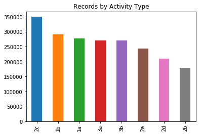
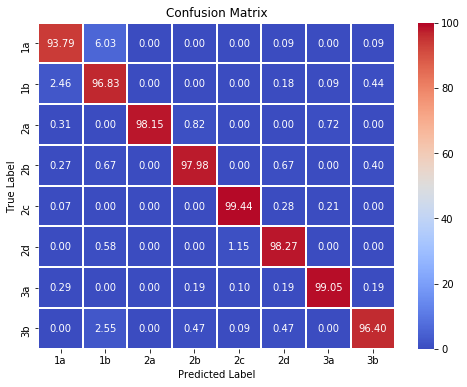
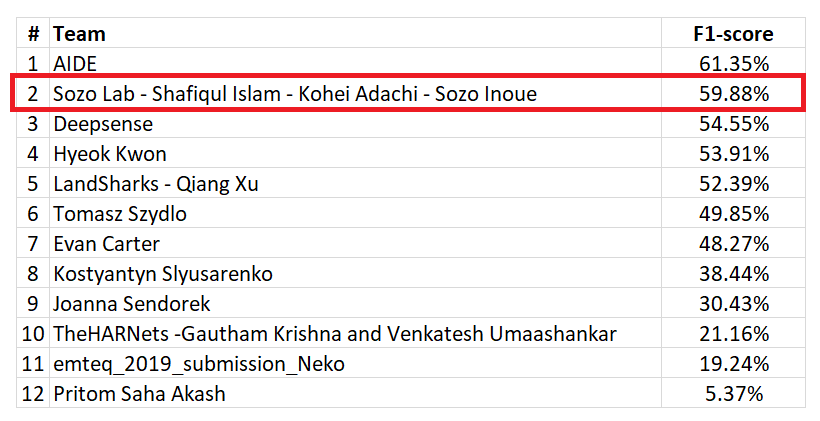

Emteq organized [Human Activty Recognition Challenge 2019](https://emteq.net/arc2019). The main theme of this challenge is to recognize different types of activities from sensor data using any machine learning model.

# Dataset

  - There are 4 persons' data. 3 persons' data is used as train data and 4th person's data is used as test data
  - Dataset download Link : [Emteq Dataset](https://www.dropbox.com/sh/55mtslq8lb4q6w3/AABL1H_9bdZG5XAAdQR-0W8qa?dl=0)

# Tools

- **Jupyter Notebook**

# Description
- **1D CNN** is used as the deep learning model
- Actity chart <br/>


- Confusion Matrix <br/>



# 1D CNN Model
```sh
model = Sequential()
model.add(Conv1D(filters=64, kernel_size=3, activation='relu', input_shape=(n_timesteps,n_features)))
model.add(Conv1D(filters=64, kernel_size=3, activation='relu', padding = 'same'))
model.add(Dropout(0.5))
model.add(MaxPooling1D(pool_size=2))
model.add(Flatten())
model.add(Dense(100, activation='relu'))
model.add(Dense(n_outputs, activation='softmax'))
```

# Prize
- 2nd prize was won from **Sozo Lab** team. [Result](https://emteq.net/arc2019) <br/>

